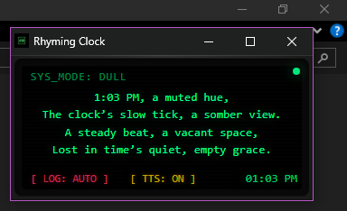

# 🕰️ Rhyming Clock

[](https://www.gnu.org/licenses/gpl-3.0)




> **A retro-styled desktop companion that turns the passing of time into poetry.**

A minimalist widget that uses AI to generate a unique rhyming poem for every minute of the day, displayed on a glowing CRT monitor.

## ✨ Features
- **AI-Powered Poetry**: Every minute, a new 2-line rhyming poem is generated based on the current time using Google Gemini AI.
- **Retro Aesthetic**: Designed with a CRT-style display, scanlines, and a pulsing power LED.
- **Minimalist Window**: Launches in a small, non-intrusive 300x200 window in the top-right corner of your screen.
- **Typing Sound Effects**: Authentic mechanical typing sounds as the poem appears (volume adjustable).
- **Text-to-Speech (TTS)**: Poems are read aloud automatically using the free, local Web Speech API. Multiple voice options available. No internet required for speech.
- **Time-Based Personalities**: The clock's "mood" changes throughout the day:
  - 🌅 **Morning**: Motivating & energetic.
  - ☀️ **Noon**: Dull & monotonous.
  - 🌆 **Evening**: Easy & relaxed.
  - 🌙 **Night**: Kinky & provocative.
- **Automated Local Logging**: Every poem is automatically recorded to `rhyming-clock-log.txt` via a background helper.
- **Resource Efficient**: Ultra-low resource usage. The app syncs with the system clock and only refreshes once per minute.
- **Smart Background Pause**: Automatically pauses all AI generation and processing when the window is minimized or hidden.
- **Improved Reliability**: Robust launcher script with automatic path correction and screen detection.

## 🚀 Getting Started

### Prerequisites
1. **Google Chrome** or **Microsoft Edge** (Chromium-based browser).
2. **Gemini API Key**: To get the rhyming poems, you need a free API key from [Google AI Studio](https://aistudio.google.com/).

### Installation & Setup
1.  Clone or download this repository.
2.  Create a file named `.env` in the same folder.
3.  Add your API key to it like this:
    ```
    GEMINI_API_KEY=AIqs......
    ```
4.  Save the file.

### Running the Clock
Simply double-click **`rhyming-clock.bat`**. 

This will automatically:
1. Start a minimized background logger window.
2. Launch the clock widget and position it in the top-right corner.
3. Automatically connect the clock to the logger (**`[ LOG: AUTO ]`** will appear).

You can close the launcher terminal, but keep the minimized **Rhyming Clock Logger** window open if you wish to record your poems.

## 🛠️ Customization
- **Change Window Size**: Edit the `WIDTH` and `HEIGHT` values in `rhyming-clock.bat`.
- **Change Poem Style**: Modify the `poemPrompt` in the `TRANSLATIONS` section of `rhyming-clock.html`.
- **Colors & Fonts**: Standard CSS can be modified in the `<style>` block of `rhyming-clock.html`.
- **TTS Voice**: Change `TTS_PREFERRED_VOICE` in `rhyming-clock.html`. Options include `Microsoft David`, `Microsoft Zira`, `Google US English`, etc.
- **Typing Sound Volume**: Adjust `TYPING_SOUND_VOLUME` in `rhyming-clock.html` (range: `0` to `0.05`).

## 🤝 Contributing
Contributions are welcome! Please read [CONTRIBUTING.md](CONTRIBUTING.md) for details on our code of conduct and the process for submitting pull requests.

## 📖 Documentation
- **[Design Philosophy](DESIGN_PHILOSOPHY.md)**: The "Why" behind the project and its core principles.
- **[Technical Walkthrough](CODE_DOCUMENTATION.md)**: In-depth details on the architecture, code functions, and API integrations.


## ⚠️ Security Note
**Never commit your `rhyming-clock.html` with your real API key inside.**
If you fork this repository, ensure your API key is removed from the code before pushing.

## 📄 License
This project is licensed under the GNU General Public License v3.0 - see the [LICENSE](LICENSE) file for details.
